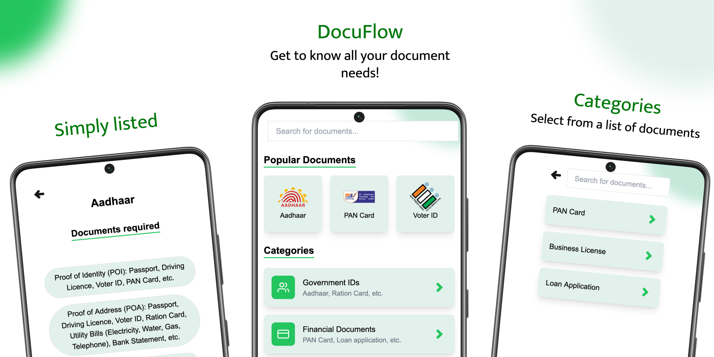

---

<strong>DocuFlow</strong>

[pronunciation: Doc-you-flow]

## Basic Details
### Team Name: Redux

### Team Members
- Team Lead: **Mohammed Fahad** - Government Engineering College Palakkad
- Member 2: **Mahir Sahal** - Government Engineering College Palakkad
- Member 3: **Mohammed Muflih** - Government Engineering College Palakkad

### Project Description
This app aims to reduce the hassle of applying for a document. It suggests the user of all the required document needed for an application.

### The Solution (that nobody asked for)
We collect data from a temperature sensor and play accurate melodies for you 🎶

## Technical Details

### Setup and usage
`.....`

### Technologies/Components Used
- **Frontend:** NextJS
- **Backend:** Express (NodeJS) along with google generative AI API

## Team Contributions
- **Mohammed Fahad**: Server side logic, Frontend
- **Mahir Sahal**: UI Designing, Documentation
- **Mohammed Muflih**: Frontend

---
Made with ❤️ at Matrix Hackathon 2025
